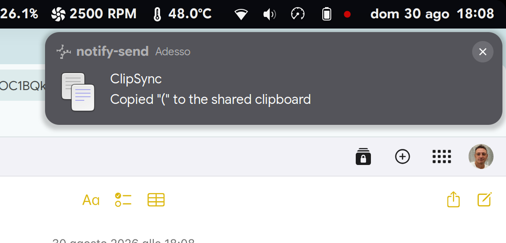
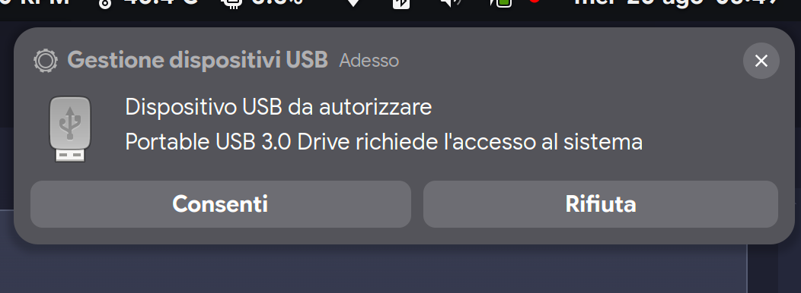
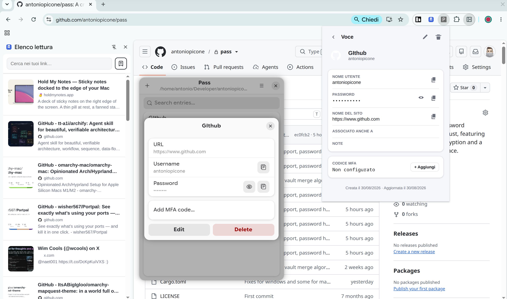
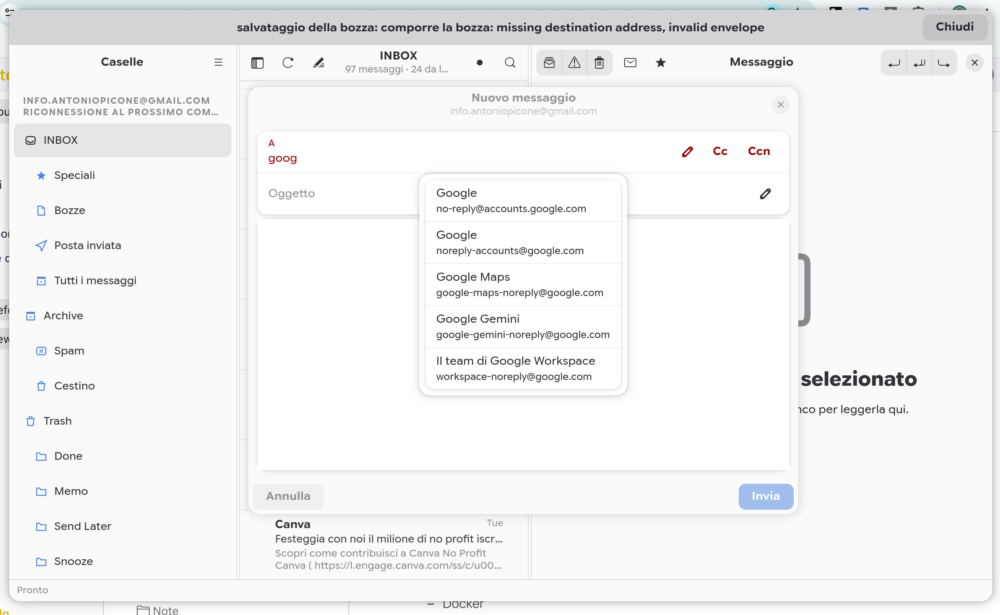
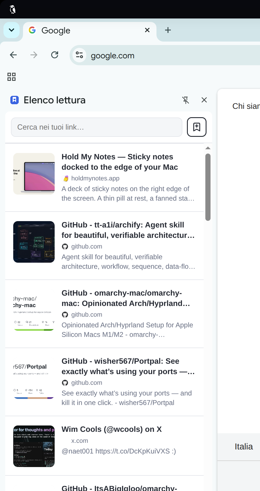
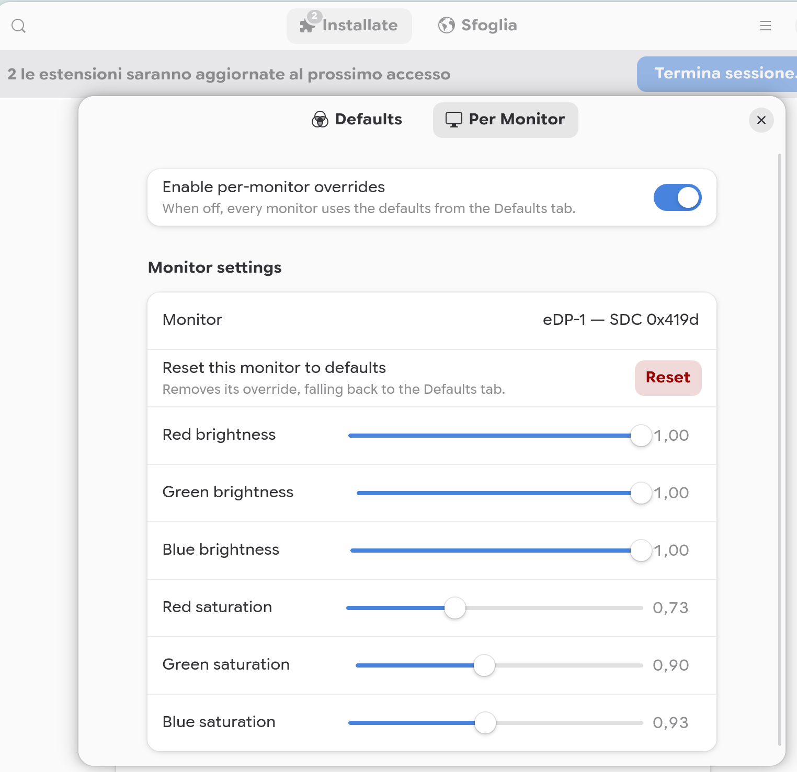

# Ultimate Linux Setup (for humans)

An overview of my Linux setup: distro, desktop environment, system tooling, and a few handcrafted pieces of software to fill the gaps left by commercial ecosystems.

- **Distro:** CachyOS
- **DE:** GNOME / Hyprland + Niri + Dank

---

## Core Features

- **Filesystem:** BTRFS
- **Swap/RAM compression:** zram
- **Kernel:**
  - Optimized for x86_v3 and LTO
  - Scheduler: BORE (better for desktop)
- **Boot manager:** Limine (supports snapper and BTRFS)

---

## Backups

- **System snapshots:** snapper + grub-btrfs (select snapshot at boot) + btrfs-assistant (GUI)
- **User file backups (Time Machine like):** restic + Déjà Dup (GUI)

---

## System Features

- Wake on USB/Bluetooth

---

## Universal Clipboard

**ClipSync** — handcrafted shared clipboard across my devices.

- Repo: [https://github.com/antoniopicone/clipsync/](https://github.com/antoniopicone/clipsync/)

---

## Security

- **Disk encryption:** LUKS with TPM2 unlock
- **Face recognition unlock:** Howdy
- **USBGuard** to prevent auto-mounting of USB devices, with a fork of USBGuard notifier for dedicated notification

  

  - Setup script [gist](https://gist.github.com/antoniopicone/2c2e8c005f421a432110100cec6bbb3a#file-setup-usbguard-sh)
  - USBGuard Notifier fork [https://github.com/antoniopicone/usbguard-notifier](https://github.com/antoniopicone/usbguard-notifier)

- **Password manager: Pass** (handcrafted) — also available as a Chrome/Brave extension

  

  - Repo: [https://github.com/antoniopicone/pass/](https://github.com/antoniopicone/pass/)

---

## Applications

- **Terminal:** zsh on Ghostty
- **Resource viewer:** Resources (by nokyan, on Software)
- **Markdown editor:** Zennotes (extracted from squashfs-root + created a .desktop file)
- **Email: Melia / Mailview** (handcrafted)

  

  - Repo: [https://github.com/antoniopicone/email](https://github.com/antoniopicone/email)

- **Reading List / Bookmarks: Karakeep**, with a dedicated handcrafted sidebar for Chromium/Brave

  

  - Repo: [https://github.com/antoniopicone/karakeep-browser-extension](https://github.com/antoniopicone/karakeep-browser-extension)

- **Browser:** Chromium / Brave with extensions:
  - Karakeep sidebar (handcrafted)
  - Pass (handcrafted)

---

## Tweaks / Fixes

- **Oversaturation: Display Color Correction** (handcrafted GNOME extension), with per-monitor configuration

  

  - Repo: [https://github.com/antoniopicone/gnome-display-color-correction-extension](https://github.com/antoniopicone/gnome-display-color-correction-extension)

- **Wake on USB** (gist): https://gist.github.com/antoniopicone/812fab59aba535a70e8ed3258b479534
- **Touchpad scrolling:** Wayland Scroll Factor (0.18 vertical scroll)
- **Icon set:** Yaru (Prussian Green Dark), installed via `yay -S yaru-icon-theme`

---

## Services

- Tailscale
- Podman
- Avahi-daemon
- restic
